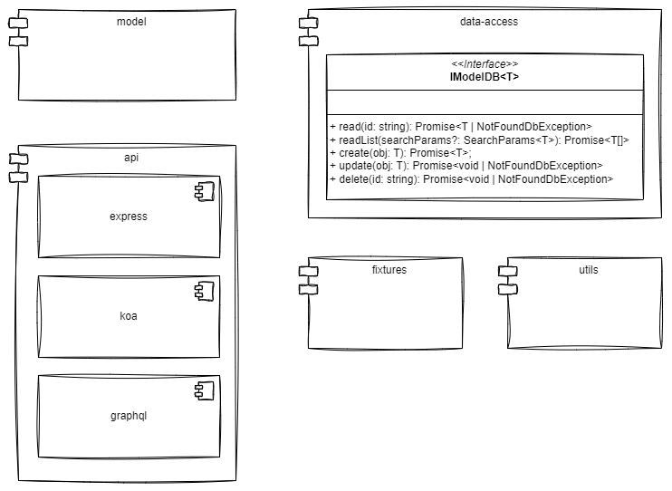

# UML Architecture Diagram

This schema shows the diferent app parts:
- **Model**: All domiand model classes
- **Data Access Layer**: Thee is a interface which different implementation systems must respect. This is a very good software practice but sadly ignored...
- **API**: The diffrent system to obtain the domain info. At this moment we only have express.
- **Fixtures**: Utils for fill database info
- **Utils**: Common utils for the rest of the modules

